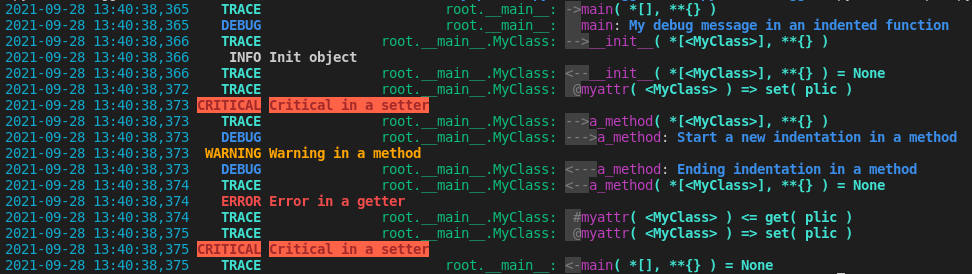

CiLogger package
================

The cilogger module extends the python logging module to indent and color the logs and provides a log level of
type "TRACE". It also contains two decorators:

* A function decorator "@ftrace" that allows you to log function calls with its arguments
* A class decorator "@ctrace" that lets you log class method and property calls
  * \@ is used to show that it's a setter property call
  * \# is used to show that it's a getter property call


Install :
---------

```
pip install git+https://github.com/christophe-marteau/python-cilogger#egg=cilogger
```

Use :
-----

```python
# coding: utf-8

import sys
import cilogger.cilogger
log = cilogger.cilogger.ccilogger(__name__)


@cilogger.cilogger.ctrace
class MyClass(object):
    def __init__(self):
        self.__log__.info('Init object')
        self._myattr = None

    def a_method(self):
        self.__log__.indent('DEBUG', 'Start a new indentation in a method')
        self.__log__.warning('Warning in a method')
        self.__log__.unindent('DEBUG', 'Ending indentation in a method')

    @property
    def myattr(self):
        self.__log__.error('Error in a getter')
        return self._myattr

    @myattr.setter
    def myattr(self, value):
        self._myattr = value
        self.__log__.critical('Critical in a setter')

    def __repr__(self):
        return '<{}>'.format(self.__class__.__name__)

    @property
    def __log__(self):
        return cilogger.cilogger.ccilogger('{}.{}'.format(self.__class__.__module__, self.__class__.__name__))

@cilogger.cilogger.ftrace
def main():
    log.debug('My debug message in an indented function')
    mc = MyClass()
    mc.myattr = 'plic'
    mc.a_method()
    x = mc.myattr
    x = '{}'.format(x)
    mc.myattr = x


if __name__ == '__main__':
    cilogger.cilogger.rootlogger.setLevel('TRACE')
    sys.exit(main())
```

    Example output with colorized and indented logs:


If you want per level custom formatter you have to replace (in this example to customize TRACE and DEBUG levels):

```python
# coding: utf-8
import sys
import cilogger.cilogger
log = cilogger.cilogger.ccilogger(__name__)
```

by :

```python
# coding: utf-8
import sys
import cilogger.cilogger

rootlogger = cilogger.cilogger._rcilogger({
    'INFO' : '<color fg=cyan>{asctime:12s}</> '
             '<level>{levelname: >8s}</> '
             '<level>{message}</>',
    'WARNING' : '<color fg=cyan>{asctime:12s}</> '
                '<level>{levelname: >8s}</> '
                '<level>{message}</>',
    'ERROR' : '<color fg=cyan>{asctime:12s}</> '
              '<level>{levelname: >8s}</> '
              '<level>{message}</>',
    'CRITICAL' : '<color fg=cyan>{asctime:12s}</> '
                 '<level>{levelname: >8s}</> '
                 '<level>{message}</>',
})

log = rootlogger.getChild(__name__)
```

Full example is available in "/doc/source/example-custom-formater-per-level.py" and gives this output:




    Copyright (C) 2019  Christophe Marteau

    This program is free software: you can redistribute it and/or modify
    it under the terms of the GNU General Public License as published by
    the Free Software Foundation, either version 3 of the License, or
    (at your option) any later version.

    This program is distributed in the hope that it will be useful,
    but WITHOUT ANY WARRANTY; without even the implied warranty of
    MERCHANTABILITY or FITNESS FOR A PARTICULAR PURPOSE.  See the
    GNU General Public License for more details.

    You should have received a copy of the GNU General Public License
    along with this program.  If not, see <https://www.gnu.org/licenses/>
